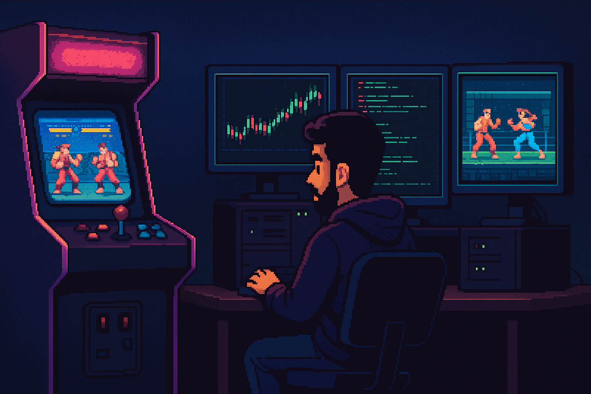

  

<h1 align="center">
  
</h1>

<h3 align="center">SKILLS LOADED</h3>

  

<h3 align="center">SOCIALS</h3>

  
  
  

---

  <em>Fun Fact:</em> The original Street Fighter arcade board ran on just 8-bit RAM—I'm pushing Solidity smart contracts today 🚀

